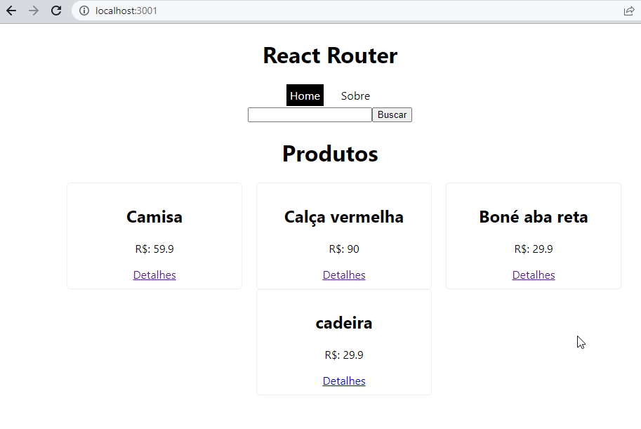

# React router

 Baseado no curso do Matheus Bastitti (React do zero a maestria) - seção 8 (React Router)

 utilizamos o react-router-dom e o json-server

 Executar `npm run server` - servidor fake json vai rodar na porta 3000
 Execvutar `npm start` - aplicação vai rodar em outra porta

 Tela principal da aplicação:
 